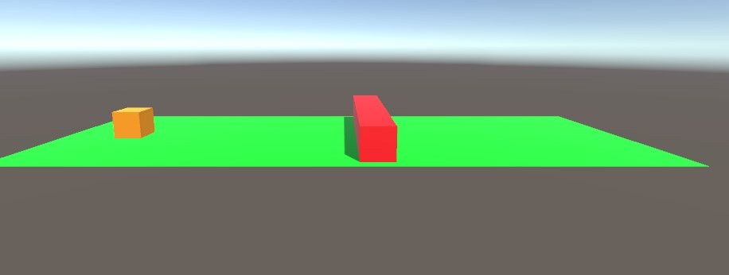
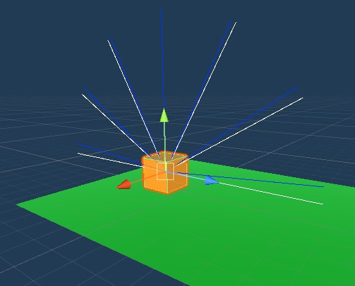
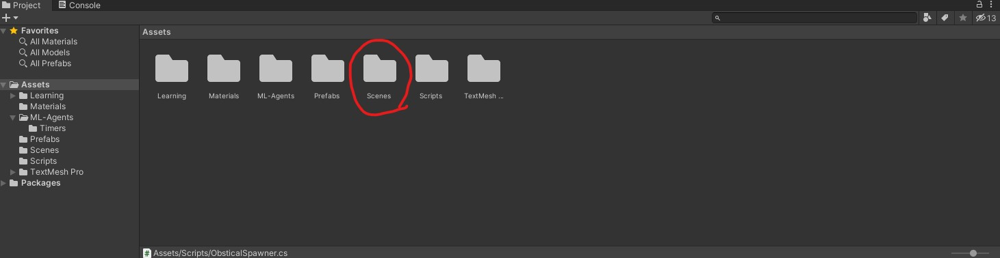
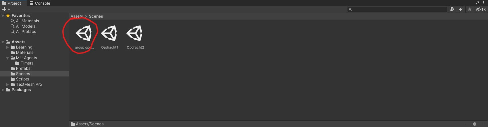
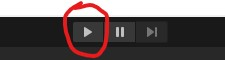
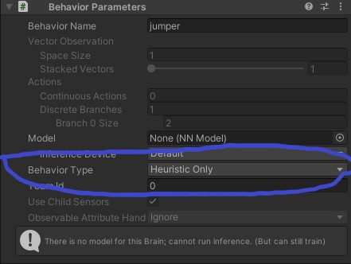
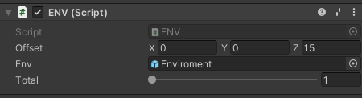
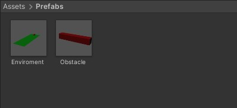
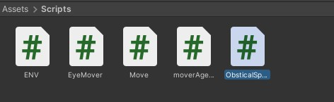
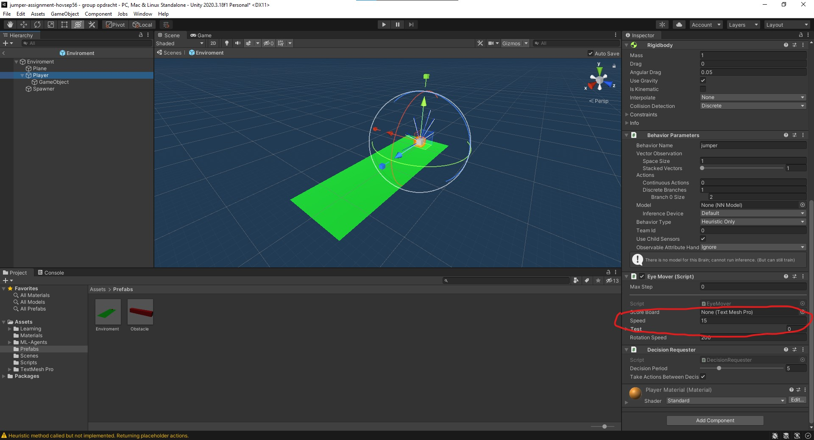

# Tutorial en beschrijving


## Inleiding

Deze document is gemaakt om uit te leggen hoe het je het spel kan gebruiken en wat het normale proces van het spel is.

Als extra hebben we op laatste van deze document een paar optioneele functies getoont zodat u zelf met deze spel kan spelen om beter onze opdracht te verbeteren.

## Spelverloop, beloning en actieruimte

In deze spel moet de speler (oranje blok) door het obstakel (rode rechthoekig blok) die langzaam naar het speler gaat, springen.

Als het obstakel het speler raakt eindigt het episode en begint het proces opnieuw met een straf aan hun "reward" punten. Maar als de speler door het obstakel kan springen dan krijg de agent een beloning end begint de episode opnieuw.

Om natuurlijk te vermijden dat de speler niet de hele tijd springt, krijgt de speler een kleine beloning als hij de Plane aanraakt.



## Ray perception

De rays verzorgt dat de agent weet waar en hoe ver het obstacal zig bevint.



## Code

Met dit deel van de code krijgt de agent om de seconde 0.1 Punt.
Om de 2 minuten word het herstart.

```csharp
void Update()
{
    var d = Time.time - lastTime;
    if(d > 1)
    {
        lastTime = Time.time;
        AddReward(0.1f);
    }
    scoreBoard.text = "Score: " + GetCumulativeReward().ToString("f4");
    time += 1 * Time.deltaTime;
    if(time > 120)
    {
        time = 0;
        EndEpisode();
    }
}
```

Als het brein van de agent denkt dat die moet gaan springen dan word er eerst gecheckt of dat hij wel degelijk op de grond is.

```csharp
public override void OnActionReceived(ActionBuffers vectorAction)
{
    var action = vectorAction.DiscreteActions;
    // Agent need to jump
    if (action[0] == 1)
    {
        if (IsGrounded)
        {
            Vector3 translation = transform.up * Speed * Time.deltaTime;
            mRigidBody.velocity = translation;
        }
    }
}
```

## Componenten


## Configuratie

Confegiratie van het brain traning

```yaml
behaviors:
  jumper:
    trainer_type: ppo
    hyperparameters:
      batch_size: 32
      buffer_size: 256
      learning_rate: 0.0003
      beta: 0.005
      epsilon: 0.2
      lambd: 0.95
      num_epoch: 3
      learning_rate_schedule: linear
    network_settings:
      normalize: false
      hidden_units: 20
      num_layers: 1
      vis_encode_type: simple
    reward_signals:
      extrinsic:
        gamma: 0.9
        strength: 1.0
    keep_checkpoints: 5
    max_steps: 5000000000
    time_horizon: 3
    summary_freq: 10000
```

## Resultaten en conclusie


## Instructies

- Ga naar de &quot;scenes&quot; folder in de asset explorer.


- Dubbel klik de &quot;group opdracht&quot; scene.


- (inference) Druk de start knop op de top van het scherm.
(de brain is al geplaatst op de speler).



- (hueristic) Selecteer "hueristic only" in de behavior parameters van de speler
om de speler zelf te controleren. (spacebar om het te laten springen).




## Optioneel functies
- Klik de EnvSpawner en kies hoeveel enviroments u wilt spawnen door de "total" slider te bewegen.


- U kunt de prefabs vinden in de "Prefabs" folder in het asset explorer, daar vind u de enviroment+speler prefab en de obstacle prefab.


- klik de "scripts" folder om de "eyemover" script te vinden en andere scripts dat we gebruiken zoals (ENV,ObsticleSpawner en Move)


- de mover.yaml file kunt u in de learning folder vinden in het asset explorer.

- de Speed attribute van het eye mover script bij de speler controleert de hoogte het jump, verander het als u wilt dat de speler hoger of lager springt.

